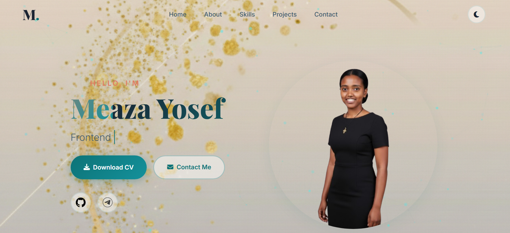
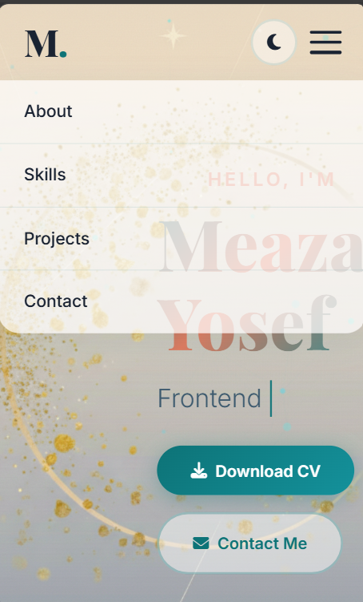

🌐 My Portfolio Website

Welcome to my personal portfolio website!
This project showcases my skills, projects, and experience as a developer.

🚀 Live Demo

👉 


📌 About the Project

This is a personal portfolio website built to present:

* My profile and background
* My technical skills
* My projects
* Contact information


 🛠️ Built With

* HTML5
* CSS3
* JavaScript

 📂 Project Structure

```
MY-PORTFOLIO-WEBSITE/
|-cv
|-images
    |-bakgrounf.jpg
    |- ...
│── index.html
│── mediaqueries.css
│── script.js
│── style.css
|-screenshoot

```

✨ Features

* Responsive design (works on mobile & desktop)
* Smooth scrolling navigation
* Dark/Light mode toggle

 📸 Screenshots





⚙️ How to Run Locally

1. Download or clone the repository
2. Open the folder
3. Double-click `index.html`


 Contact Me

📧 Email: nafkotemaye2013@gmail.com
📞 Phone: 0993645874
💻 GitHub: nafkote21

📄 License

This project is open source and free to use.


 🙌 Acknowledgements

Thanks to all the resources and tutorials that helped me build this project.

